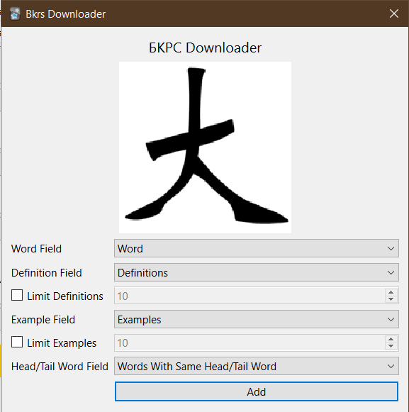

Anki add-on to get Chinese word definitions and example sentences from https://bkrs.info

[YellowBridge](https://www.yellowbridge.com/) is additionally used to get words starting
with the same head/tail words.

## Credit

Icons are taken from https://bkrs.info/
